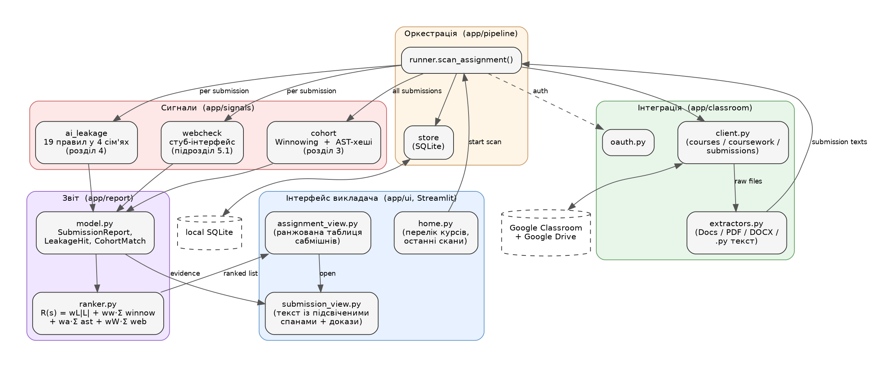

# Титульний аркуш

КИЇВСЬКИЙ НАЦІОНАЛЬНИЙ УНІВЕРСИТЕТ ІМЕНІ ТАРАСА ШЕВЧЕНКА

Факультет комп'ютерних наук та кібернетики

Кафедра теоретичної кібернетики

Кваліфікаційна робота

на здобуття ступеня бакалавра

за спеціальністю 122 Комп'ютерні науки

на тему:

**ЗАСОБИ ВИЯВЛЕННЯ ПЛАГІАТУ У ВИКОНАНИХ НАВЧАЛЬНИХ ЗАВДАННЯХ З ПРОГРАМУВАННЯ**

Виконав студент 4-го курсу

ОПП «Інформатика»

Коркач Олександр Сергійович \_\_\_\_\_\_\_\_\_\_

(підпис)

Науковий керівник:

доцент кафедри теоретичної кібернетики

кандидат фізико-математичних наук, доцент

Карнаух Тетяна Олександрівна \_\_\_\_\_\_\_\_\_\_

(підпис)

Засвідчую, що в цій роботі немає запозичень з праць інших авторів без відповідних посилань.

Студент \_\_\_\_\_\_\_\_\_\_

(підпис)

Роботу розглянуто й допущено до захисту на засіданні кафедри теоретичної кібернетики

«\_\_\_\_\_» \_\_\_\_\_\_\_\_\_\_\_\_\_\_\_\_\_ 2026 р., протокол № \_\_\_\_\_

Завідувач кафедри

доктор фізико-математичних наук, професор

Юрій КРАК \_\_\_\_\_\_\_\_\_\_

(підпис)

КИЇВ 2026

\newpage

# РЕФЕРАТ

Обсяг роботи — 56 сторінок, 6 ілюстрацій, 8 таблиць, 27 джерел посилань, 3 додатки.

ВИЯВЛЕННЯ ПЛАГІАТУ В КОДІ, АКАДЕМІЧНА ДОБРОЧЕСНІСТЬ, GOOGLE CLASSROOM, WINNOWING, АНАЛІЗ СИНТАКСИЧНОГО ДЕРЕВА, ВЕЛИКА МОВНА МОДЕЛЬ, ПРАВИЛОВА ТАКСОНОМІЯ, ПОЯСНЮВАНІСТЬ, РАНЖУВАННЯ, ОЦІНЮВАННЯ.

Об'єктом дослідження є процес перевірки на ознаки плагіату й недбалого використання великих мовних моделей у письмових сабмішнах студентів, поданих у середовищі Google Classroom у межах курсів із програмування.

Предметом дослідження є методи та програмні засоби виявлення трьох типів ознак запозичення в таких сабмішнах: збіги з відкритими веб-ресурсами, парафразо-стійка подібність між сабмішнами в межах когорти та між когортами, а також виявлення характерних артефактів, що супроводжують недбале копіювання з результатів роботи мовних моделей.

Мета роботи — спроєктувати й реалізувати **відкритий, локально розгортуваний інструмент** для викладача, що інтегрує наявні в окремих комерційних і академічних рішеннях функції перевірки в єдиний дашборд, працює на сабмішнах англійською й українською мовами, не потребує платної підписки й не передає сабмішни за межі робочої станції викладача, а на рівні ухвалення рішень спирається на детерміновані методи замість ML-класифікаторів.

У роботі використано методи теорії інформаційного пошуку (Winnowing-фінгерпринтінг на нормалізованому потоці токенів), методи аналізу синтаксичних дерев (хешування піддерев AST зі стійкою до перейменувань канонізацією), правилову інженерію з прозорою оцінкою точності й відклику кожного правила, методи зовнішнього оцінювання на синтетичних корпусах. Інструменти розроблення: мова Python (стандартний `tokenize`, стандартний `ast`, без обов'язкових сторонніх бібліотек у каналах сигналів), бібліотеки google-api-python-client, Streamlit, SQLite, Pydantic.

Результати роботи: проаналізовано наявні комерційні (Moss, JPlag, Dolos для сорсів; Turnitin, Google Classroom Originality Reports, CopyLeaks для текстів; ML-детектори ШІ-тексту) засоби виявлення плагіату й перелічено їхні обмеження для українського ринку — вартісний бар'єр, недоступність для безкоштовних тарифів, відсутність інтеграції перевірки на сліди мовних моделей у сорсах коду. Реалізовано двоканальну архітектуру внутрішньокогортного порівняння — Winnowing + AST-хешування — з очікуваною стійкістю до перейменування ідентифікаторів і структурних змін. Розроблено детерміновану таксономію з 19 правил у чотирьох сім'ях для виявлення характерних слідів недбалого використання мовних моделей у вихідному коді, одразу з підтримкою англійської й української мов. Реалізовано прозорий ранжувальник сигналів зі сталими вагами й дашборд для викладача на Streamlit. Виміряно: ROC-AUC обох каналів когортного порівняння на синтетичному корпусі з 100 пар — 1.00; точність 16 з 19 правил таксономії на синтетичному корпусі з 130 прикладів — 1.00 за відклику 1.00; ручний прогін на 12 тестових сабмішнах дав очікувані результати в усіх дванадцяти випадках.

Робота продовжує тематику запобігання порушенням академічної доброчесності в системах дистанційного навчання. Результати можуть бути використані викладачами українських вишів для попередньої перевірки сабмішнів вихідного коду в курсах із програмування без оплати комерційних підписок. Подальший розвиток передбачає підтримку C/C++/Java, інтеграцію з системами керування навчанням, відмінними від Google Classroom, збір корпусу реальних студентських сабмішнів і періодичне поновлення таксономії правил у міру зміни поведінки сучасних мовних моделей.

\newpage

# ЗМІСТ

СКОРОЧЕННЯ ТА УМОВНІ ПОЗНАКИ

ВСТУП

1 АНАЛІЗ ПРЕДМЕТНОЇ ОБЛАСТІ ТА ІСНУЮЧИХ РІШЕНЬ

1.1 Академічна доброчесність і види плагіату в навчальних завданнях

1.2 Огляд існуючих засобів виявлення плагіату

1.3 Український контекст і запит на локальне відкрите рішення

1.4 Прояви недбалого використання великих мовних моделей у коді

1.5 Постановка завдання

2 АРХІТЕКТУРА ЗАПРОПОНОВАНОГО ЗАСОБУ

2.1 Загальна структура інструменту

2.2 Інтеграція з Google Classroom і витяг тексту

2.3 Модель даних і збереження стану

2.4 Принцип посигнальних доказів замість єдиного балу

3 ВНУТРІШНЬОКОГОРТНЕ ПОРІВНЯННЯ ВИХІДНОГО КОДУ

3.1 Нормалізація токенового потоку

3.2 Канал Winnowing-фінгерпринтів

3.3 Канал хешів піддерев AST

3.4 Об'єднання каналів і ранжування пар

3.5 Складність, межі застосовності, інженерні рішення

3.6 Емпірична оцінка обох каналів

4 ТАКСОНОМІЯ ОЗНАК НЕДБАЛОГО ВИКОРИСТАННЯ МОВНИХ МОДЕЛЕЙ У КОДІ

4.1 Дизайн-принципи: висока точність, прозоре спрацювання

4.2 Категорії й перелік правил

4.3 Інженерія правил як даних

4.4 Чому правила, а не ML-класифікатор

4.5 Емпірична оцінка таксономії

5 ІНТЕГРАЦІЯ СИГНАЛІВ, ІНТЕРФЕЙС ВИКЛАДАЧА Й ЗАГАЛЬНЕ ОЦІНЮВАННЯ

5.1 Канал зовнішнього веб-плагіату

5.2 Ранжування сабмішнів

5.3 Інтерфейс викладача

5.4 Системний експеримент на тестових сабмішнах

5.5 Обмеження та подальша робота

ВИСНОВКИ

ПЕРЕЛІК ДЖЕРЕЛ ПОСИЛАННЯ

ДОДАТОК А Приклад звіту по сабмішну

ДОДАТОК Б Скорочений перелік правил таксономії

ДОДАТОК В Конфігурація запуску оцінювального стенду

\newpage

# СКОРОЧЕННЯ ТА УМОВНІ ПОЗНАКИ

API — програмний інтерфейс застосунку (Application Programming Interface)

AUC — площа під ROC-кривою (Area Under the Curve)

DOCX — формат документа Office Open XML

AST — абстрактне синтаксичне дерево (Abstract Syntax Tree)

DOCX — формат документа Office Open XML

HC3 — корпус Human-ChatGPT Comparison Corpus

JSON — JavaScript Object Notation, текстовий формат обміну даними

LLM — велика мовна модель (Large Language Model)

M4 — Multi-generator, Multi-domain, Multi-lingual MGT detection corpus

MGT — машинно-згенерований текст (Machine-Generated Text)

OAuth — протокол делегованої авторизації

PDF — Portable Document Format

ROC — Receiver Operating Characteristic, операційна характеристика приймача

SQL — Structured Query Language

UI — інтерфейс користувача (User Interface)

URL — Uniform Resource Locator

ШІ — штучний інтелект

\newpage

# ВСТУП

Сьогодні навчальні завдання у курсах з програмування подаються переважно у вигляді файлів вихідного коду через системи керування навчанням. У Київському національному університеті імені Тараса Шевченка значна частка таких сабмішнів проходить через сервіс Google Classroom. Питання автоматизованої перевірки коду на запозичення в цих умовах стає окремим практичним викликом, передусім для українських вишів. Спеціалізовані академічні засоби перевірки коду — Moss, JPlag, Dolos — мають окремі CLI- й веб-інтерфейси, до яких треба експортувати сабмішни вручну й окремо від основного робочого процесу [6; 7; 8]. Жоден з них не виконує перевірку на сліди недбалого використання мовних моделей у коді — преамбули в коментарях, markdown-розмітку, що пережила копіювання з чат-інтерфейсу, шаблонні `Time complexity: O(n²)`-коментарі. Комерційні системи, які покривають супутні текстові сабмішни (Turnitin, CopyLeaks, платні рівні Google Classroom Originality Reports), коштують кілька десятків тисяч доларів на рік за інституційну ліцензію [19; 20; 22] і за побудовою не покривають саме сорсів коду; для українських вишів додатковим обмеженням є англомовний фокус, передача даних за межі України та брак повноцінної інтеграції з Classroom-нативним робочим процесом.

Окремою віссю проблеми стало масове використання великих мовних моделей у виконанні навчальних завдань з програмування. Існуючі ML-класифікатори типу CopyLeaks AI Detector чи Turnitin AI Writing Detection [24; 26] орієнтовані на природномовний текст, є чорними скриньками з відомими систематичними зміщеннями [15], непридатними до прямого цитування у звітах перед академічною комісією. Літературний фронт у відповідь розробляє таксономії підказок, які людина може застосувати самостійно [27].

Об'єкт дослідження — процес виявлення ознак плагіату й недбалого використання великих мовних моделей у сабмішнах вихідного коду, поданих студентами через Google Classroom у межах курсів із програмування.

Предмет дослідження — методи й програмні засоби виявлення трьох типів ознак запозичення у вихідному коді сабмішнів: внутрішньокогортна подібність між сорсами, стійка до перейменування ідентифікаторів і структурних еквівалентних змін; характерні артефакти недбалого копіювання з результатів роботи мовних моделей у коментарях і docstring'ах коду; зовнішні веб-збіги (компонент у поточній ітерації стубовано).

Актуальність роботи зумовлена сполученням чотирьох чинників: (1) вартісним бар'єром перед українськими вишами на доступ до повного функціонала комерційних систем перевірки; (2) недостатнім покриттям україномовних сабмішнів англомовно орієнтованими сервісами, особливо в частині парафразу й машинної генерації; (3) задокументованими обмеженнями ML-класифікаторів машинно-згенерованого тексту, що робить їх непридатними до прямого академічного провадження; (4) потребою у локальному розгортанні, що зберігає сабмішни в межах інфраструктури навчального закладу. Жоден окремий компонент роботи не є технічно новим; внесок полягає в інтеграції наявних методів у самодостатній відкритий інструмент, придатний до експлуатації у вищезгаданих умовах без платних залежностей.

Мета роботи — спроєктувати й реалізувати відкритий, локально розгортуваний інструмент для викладача, що інтегрується з Google Classroom і за один прохід оцінює сабмішни обраного завдання за переліком окремих, незалежно інтерпретованих сигналів, працює англійською та українською мовами, а на рівні ухвалення рішень спирається на детерміновані методи без проміжного ML-класифікатора.

Для досягнення цієї мети сформульовано такі завдання:

— проаналізувати види плагіату в навчальних завданнях, нормативну базу академічної доброчесності в Україні та КНУ, а також наявні засоби виявлення плагіату й виявити їхні обмеження стосовно письмових сабмішнів у курсах із програмування;

— спроєктувати загальну архітектуру інструменту, що інтегрується з Google Classroom і Google Drive, забезпечує витяг тексту вихідного коду з типових форматів (`.py`, `.txt`, Google Docs, PDF, DOCX як засіб обходу для коду, вставленого в документ) та зберігає результати перевірки;

— розробити двоканальну схему внутрішньокогортного порівняння вихідного коду, у якій один канал відповідає за виявлення лексично-токенового збігу (Winnowing), а другий — за виявлення структурного збігу на рівні AST;

— укласти таксономію правил для виявлення характерних артефактів недбалого використання мовних моделей у коментарях і docstring'ах вихідного коду, із прозорим описом кожного правила, прикладами доказів і методикою емпіричної оцінки точності та відклику; одразу передбачити паралельні правила для англійської та української мов;

— розробити прозору схему ранжування сабмішнів зі сталими вагами на основі переліку сигналів та інтерфейс викладача, що подає доказову базу для кожного спрацювання;

— виміряти характеристики каналів на синтетичних корпусах і провести ручний наскрізний прогін на тестовому наборі сабмішнів.

Методи дослідження включають аналіз науково-технічних публікацій з фінгерпринтінгу коду, синтаксичного аналізу та обробки природної мови, методи правилового аналізу, методи побудови інформаційних систем. Інструменти розроблення: мова Python (стандартний `tokenize`, стандартний `ast`), бібліотеки google-api-python-client, Streamlit, SQLite, Pydantic.

Можливі сфери застосування результатів роботи: попередня перевірка письмових сабмішнів викладачами в курсах із програмування; побудова кафедральних або факультетських систем академічного контролю; розширення інструменту для перевірки робіт іншими мовами навчання.

Робота виконана індивідуально, у межах освітньої програми «Інформатика» спеціальності 122 Комп'ютерні науки. На момент її підготовки автор не оприлюднював результатів у наукових виданнях; робота розглядається як основа для подальших публікацій.

\newpage

# 1 АНАЛІЗ ПРЕДМЕТНОЇ ОБЛАСТІ ТА ІСНУЮЧИХ РІШЕНЬ

## 1.1 Академічна доброчесність і види плагіату в навчальних завданнях

Поняття академічної доброчесності в українському законодавстві закріплене у статті 42 Закону України «Про освіту» [2]. Серед перелічених у цій статті порушень академічний плагіат визначений як оприлюднення чужих здобутків (повністю або частково) під своїм іменем без посилання на справжніх авторів. У Законі України «Про вищу освіту» [1] перевірка кваліфікаційних робіт на плагіат прямо визначена як обов'язкова частина атестації. У Київському національному університеті імені Тараса Шевченка відповідні процедури деталізовані окремим положенням [5] та закріплені в методичних вказівках факультету комп'ютерних наук та кібернетики [4].

Опубліковані огляди розрізняють кілька груп проявів плагіату в навчальних роботах. Морер, Каппе й Зака [9] виділяють дослівне копіювання, перефразоване копіювання, мозаїчне копіювання (комбінацію фрагментів з кількох джерел), плагіат ідеї (привласнення концепції, висловленої іншою мовою або іншою лексикою), самоплагіат (повторне використання студентом власних попередньо зданих текстів без посилань) та, що особливо актуально для останніх років, плагіат за допомогою машинно-згенерованого тексту, коли студент видає згенерований мовною моделлю текст за власну роботу. Хоад і Зобел [10] окремо підкреслюють «версійні» зразки запозичень, типові саме для навчальних робіт: студент, який отримав сабмішн товариша, переписує речення, замінює синоніми, перестановкою фраз послаблює формальний збіг, але зберігає логіку викладу.

Усі перелічені прояви становлять порушення академічної доброчесності в розумінні законодавства. Принципово важливо, що у [4] прямо зазначено: низький відсоток текстових збігів, отриманий автоматизованою перевіркою, не є остаточним критерієм визнання роботи доброчесною. Цей принцип кваліфікує запропонований у роботі підхід як методологічно правильний: інструмент не зводить рішення до єдиного числа, а постачає викладача доказами, що залишаються інтерпретовними.

## 1.2 Огляд існуючих засобів виявлення плагіату

Поле автоматизованих засобів виявлення академічного плагіату ділиться на три перетинні групи: сервіси перевірки сорсів програм, загальні системи перевірки текстів, окремі детектори машинно-згенерованого тексту. Запропонований у роботі засіб лежить у першій групі й поглинає окремі функції з другої та третьої; розгляд починається саме із сервісів перевірки сорсів.

### Сервіси перевірки сорсів програм

Оскільки запропонований засіб орієнтований саме на сорси програм, ця група сервісів є його прямим прототипом і первинним базисом порівняння. Серед них найдовшу історію має Moss (Measure of Software Similarity), запропонована Шлеймером, Вілкерсоном і Айкеном [6]. У її основі — алгоритм Winnowing, який обирає з потоку гешів k-грам коду підмножину локально-мінімальних відбитків і порівнює сабмішни за їх перетином. JPlag [7] використовує токенізацію з нормалізацією ідентифікаторів та алгоритм жадного зіставлення рядків. Сучасніший Dolos [8] застосовує подібні ідеї з підтримкою багатьох мов програмування й інтерактивною візуалізацією збігів у середовищі онлайн-курсу.

Перелічені сервіси розв'язують ту саму задачу — внутрішньокогортне виявлення подібності між сорсами — і за алгоритмами лежать в одному ідейному просторі з каналом Winnowing, описаним у розділі 3. Принципові відмінності запропонованого у роботі засобу від них стосуються (а) поєднання Winnowing із другим каналом — хешуванням піддерев AST, що стійке до структурних еквівалентних змін, (б) інтеграції з виявленням артефактів недбалого використання великих мовних моделей у коді (розділ 4) і (в) Classroom-нативного інтерфейсу викладача (підрозділ 5.3). Moss і Dolos мають окремі веб-інтерфейси, до яких треба експортувати сабмішни вручну; JPlag — CLI-інструмент. Жодна з перелічених систем не виконує перевірку на сліди мовних моделей у коді.

### Загальні системи перевірки текстів

Поряд із сорсами програм у студентських сабмішнах часто присутні супровідні пояснювальні тексти — звіти про лабораторні, README, обґрунтування архітектурних рішень. Цю частину сабмішну покривають загальні системи перевірки текстів, найвідоміші з яких — Turnitin, Google Classroom Originality Reports, CopyLeaks та Unicheck (з 2020 року — частина Turnitin під брендом Turnitin Similarity). Їхні базові алгоритми спираються на n-грамне фінгерпринтування й пошук у внутрішніх індексах: вхідний документ розбивається на шинглі, для кожного шингля виконується пошук у мільярдах веб-сторінок і раніше переданих документів [19; 22]. У межах одного завдання Turnitin виконує процедуру виявлення співпраці (collusion check); Google Classroom Originality Reports для ліцензій Workspace for Education Plus підтримує School Matches з приватним репозиторієм школи [20; 21]; CopyLeaks надає Shared Data Hub з опцією Internal Protection [22]. Документація Google Originality Reports прямо констатує, що інструмент налаштований передусім на дослівні збіги з індексованим вебом і пропускає суттєво перефразований матеріал [23]; Turnitin AI Paraphrase Detection підтримує лише англійську [24; 25]; інституційні підписки Turnitin і CopyLeaks створюють вартісний бар'єр для українських вишів. Запропонований засіб не дублює функціональності цих систем у частині перевірки текстів: він орієнтований на сорси й залишає прозовий шар сабмішну поза основним пайплайном, делегуючи його будь-якій із перелічених систем як комплементарний канал на розсуд викладача.

### Детектори машинно-згенерованого тексту

З кінця 2022 року з'явилися окремі інструменти на кшталт GPTZero, OpenAI Text Classifier (припинений у 2023 році) та академічного DetectGPT [14]. Комерційні системи перевірки додали власні класифікатори: CopyLeaks AI Detector з функцією AI Phrases, що підсвічує речення з рівнем впевненості [22; 26]; Turnitin AI Writing Detection (липень 2023) і Turnitin AI Bypasser Detection (2025) для виявлення тексту, перепарафразованого спеціалізованими сервісами [25]. Усі вони орієнтовані на природномовний текст; за відомими автору джерелами, інтегрованого детектора недбалого LLM-використання саме в сорсах програм у промисловому користуванні немає.

Усі перелічені детектори побудовані на машинному навчанні й мають кілька задокументованих обмежень, які прямо стосуються академічного контексту:

— **Систематичні зміщення.** Лян зі співавторами [15] емпірично показав, що готові детектори ШІ-тексту суттєво частіше хибно класифікують роботи носіїв англійської мови як другої. Українські академічні тексти, написані англійською, потрапляють у те саме розподілення.

— **Неможливість надійного розрізнення в загальному вигляді.** Садасіван зі співавторами [13] аналітично показує, що для достатньо вмілих моделей і достатньо складних перифразів задача надійного розрізнення «текст людини — текст машини» наближається до невирішної.

— **Падіння точності за зсуву домену.** Бенчмарк MGTBench [16] фіксує істотну втрату якості, коли тестовий розподіл відрізняється від тренувального; для академічних текстів, що часто стилістично відрізняються від тренувальних корпусів, це означає нестабільні рішення.

— **Чорна скринька на рівні рішення.** Прозорість оцінок AI Phrases чи Turnitin AI Writing Score обмежена візуальним підсвічуванням; обґрунтувати оцінку перед академічною комісією як докази порушення доброчесності утруднено. Літературний фронт у відповідь розробляє таксономії ознак, які людина може застосувати самостійно [27]; такі роботи опосередковано підтверджують потребу в детермінованих, а не статистичних інструментах для academic-integrity-сценаріїв.

### Висновок з огляду

Кожна окрема функція, на якій базується запропонований засіб, уже наявна в окремих комерційних або академічних системах: Winnowing на нормалізованих токенах — у Moss [6]; жадне зіставлення на токенах — у JPlag [7]; підтримка багатьох мов плюс інтерактивна візуалізація — у Dolos [8]; підсвічування ML-моделлю фраз, схожих на машинно-згенерований текст, — у Turnitin і CopyLeaks. Внесок роботи — не у винаході нової техніки виявлення, а в **інтеграції відповідних функцій в єдиний локально розгортуваний відкритий інструмент із детермінованою методологією**, що (а) знімає вартісний бар'єр для викладачів, які працюють у безкоштовних або обмежених тарифах систем керування навчанням, (б) свідомо відмовляється від ML-класифікаторів на рівні прийняття рішень і будує перевірку на детермінованих правилах із виміряною точністю, (в) одразу підтримує україномовні сабмішни за рахунок окремих українських правил у таксономії, (г) поєднує Winnowing і структурне порівняння AST в одному пайплайні з єдиною моделлю спанових доказів, що недоступно в жодній з перелічених систем нарізно.

## 1.3 Український контекст і запит на локальне відкрите рішення

Google Classroom широко використовується у вищій школі України як засіб роздачі завдань, збору сабмішнів і ведення оцінювань. У безкоштовній конфігурації Education Fundamentals, яка є типовою для українських вишів, викладач отримує доступ до файлів сабмішнів кожного студента, але не має доступу до основних механізмів виявлення співпраці комерційних систем: School Matches в Originality Reports потребує платної ліцензії Workspace for Education Plus або Teaching and Learning [20; 21], повноцінний доступ до Turnitin або CopyLeaks вимагає корпоративної підписки [19; 22]. Через це найвразливіший канал плагіату в навчальному процесі — переписування у товаришів — у багатьох українських курсах залишається без автоматизованої перевірки.

До цього додається мовне обмеження. Turnitin AI Paraphrase Detection обслуговує лише англомовні сабмішни [25]. CopyLeaks AI Detector найкраще працює з англійською; для україномовних текстів якість моделей машинно-згенерованого тексту не задокументована. Google Originality Reports, за документацією, пропускає суттєво перефразований матеріал навіть для англійської [23]. Україномовні сабмішни в курсах із програмування поширені, але систематично не покриваються комерційними сервісами на рівні парафразу й артефактів машинної генерації.

Третій чинник — суверенітет даних. Передача робіт студентів на сервери комерційних провайдерів у юрисдикції третіх країн вимагає окремих юридичних узгоджень, а в умовах війни — додаткових застережень. Локально розгортуваний інструмент, який не передає сабмішни за межі робочої станції викладача або кафедральної інфраструктури, знімає цю групу обмежень за побудовою.

Сполучення трьох чинників — вартість, мова, суверенітет — формує запит на відкритий інструмент, який працює локально й не потребує платної підписки, підтримує україномовні сабмішни на рівні алгоритмів і даних, забезпечує самостійну перевірку всередині курсу без зовнішніх залежностей. Розроблений у цій роботі засіб орієнтований саме на такий запит.

## 1.4 Прояви недбалого використання великих мовних моделей

Якщо студент свідомо й уважно використовує мовну модель як інструмент чорнової підготовки, виявити сліди такого використання важко (і з огляду на [13] — можливо неможливо). Натомість недбале копіювання залишає характерні артефакти, які реально побачити без тренування класифікаторів і без невеликої похибки прийняти за ознаку плагіату.

У роботах [11; 12] зведено приклади структур, типових для виходу мовних моделей: однорідні переходи між абзацами, балансування довгих списків через два двокрапкові маркери, потрійна градація прикметників (overuse of triadic constructions), частий початок речень із вступних формул («Варто зазначити, що…», «Перш за все, треба підкреслити…»), а також типографічні особливості — заміна українських лапок «…» на прямі ASCII-лапки "…", характерне розставлення тире без пробілів, відсутність неприривного пробілу перед одиницями вимірювання.

Окремо, у виходах загальних чат-моделей зустрічаються фрази-преамбули («Звісно! Ось ваш текст:», «As an AI language model, I…»), фрази-відмови («Я не можу гарантувати точність…»), а також структури, що видають згенерованість на рівні дискурсу: списки, де кожен пункт побудований за тим самим шаблоном «Аспект Х: пояснення Х», блоки в стилі «Розділ 1: …Розділ 2: …», шаблонні висновкові формули («На завершення, можна стверджувати, що…»). Наявність хоча б одного такого артефакту у формальному тексті курсової роботи свідчить про неуважне копіювання й може бути предметом окремого розгляду — навіть якщо не є остаточним доказом машинної природи тексту.

Запропонований інструмент будує таксономію саме навколо таких артефактів. Кожне правило супроводжується описом ознаки, прикладом доказу й, після оцінювання на корпусах HC3 [11] та M4 [12], — числами точності й відклику. Інструмент не намагається класифікувати весь текст, а підсвічує конкретні фрагменти, які варті уваги викладача.

## 1.5 Постановка завдання

З огляду на сказане в підрозділах 1.1–1.4, основна задача цієї роботи — спроєктувати й реалізувати **відкритий, локально розгортуваний інструмент** для викладача, що поєднує наявні в окремих комерційних і академічних рішеннях функції перевірки в єдиний дашборд із детермінованою методологією й без обов'язкових платних залежностей. Принципові вимоги до інструменту:

а) інтегрується з Google Classroom і Google Drive, отримує сабмішни обраного завдання, витягує з них текст вихідного коду й зберігає в локальному сховищі;

б) виконує крос-сабмішне порівняння за двома взаємодоповнювальними каналами — Winnowing-фінгерпринтів на нормалізованому потоці токенів і хешів піддерев AST — і повертає для кожної пари сабмішнів перелік підсвічених спанів із указанням каналу й оцінкою Жаккара;

в) виконує перевірку на наявність артефактів недбалого використання мовних моделей у вихідному коді за фіксованою **таксономією детермінованих правил**, кожне з яких має вимірювані характеристики точності; жоден етап ухвалення рішення не містить ML-класифікатора, який міг би продукувати оцінку без можливості її обґрунтування перед академічною комісією;

г) надає інтерфейс для опційного зовнішнього веб-плагіату через обгортку над публічним API (CopyLeaks-сумісним); компонент необов'язковий — поведінка інструменту в режимі без зовнішнього сервісу повністю визначена;

ґ) поєднує перелічені сигнали в прозорий ранг і подає викладачеві у вигляді дашборда із доказами для кожного сабмішну, який можна процитувати в окремому документі без посилання на конкретну версію або стан інструменту;

д) працює англійською та українською мовами на рівні таксономії правил: окремі правила сім'ї `llm_comment` і `policy` обробляють україномовні преамбули, відмови та сервісні репліки в коментарях коду.

Кожна з перелічених підзадач має свій модуль у програмному коді й окремий розділ у цій роботі. Очікувані результати — не нові алгоритми виявлення плагіату, а **інженерна інтеграція** наявних методів у самодостатній відкритий продукт з виміряними характеристиками точності й відомими межами застосування, придатний до експлуатації в українських вишах без платних підписок і без передачі даних за межі робочої станції викладача.

\newpage

# 2 АРХІТЕКТУРА ЗАПРОПОНОВАНОГО ЗАСОБУ

## 2.1 Загальна структура інструменту

Інструмент побудований як окремий локальний застосунок, який запускається на робочій станції викладача. Такий вибір продиктований двома міркуваннями. По-перше, сабмішни студентів містять персональні дані й результати інтелектуальної праці, тому небажано без потреби передавати їх на сторонні сервери. По-друге, на ранніх етапах апробації локальний запуск спрощує налаштування й не потребує розгортання серверної інфраструктури на рівні факультету.

Архітектурно засіб ділиться на п'ять верств (рисунок 2.1):

— верства інтерфейсу викладача (Streamlit-застосунок) приймає команди й відображає результат;

— верства оркестрації (модуль `pipeline.runner`) керує запуском перевірки за обраним завданням;

— верства інтеграцій (модуль `classroom`) відповідає за роботу з Google Classroom і Google Drive — авторизацію за протоколом OAuth, завантаження сабмішнів, витяг тексту з форматів Google Docs, PDF, DOCX;

— верства сигналів містить три незалежні модулі: `signals.cohort` виконує внутрішньокогортне порівняння (розділ 3), `signals.ai_leakage` виконує перевірку за таксономією правил (розділ 4), `signals.webcheck` опційно перевіряє сабмішн через зовнішній API (розділ 5);

— верства звіту й персистентності (`report` і `pipeline.store`) формує звіт за результатами перевірки й зберігає результати у локальній базі SQLite.

Між верствами визначені вузькі контракти. Зокрема, кожен модуль сигналу повертає об'єкт типу `SignalResult`, що містить перелік об'єктів `Hit` з полями: ідентифікатор правила або каналу, посилання на сабмішн і спан тексту, об'єкт-підтвердження (наприклад, вирівняні фрагменти з іншого сабмішну або фразу-преамбулу), числове значення впевненості. Цей контракт дозволяє розширювати інструмент новими сигналами без модифікації ранкера й інтерфейсу.



## 2.2 Інтеграція з Google Classroom і витяг тексту

Інтеграція з Google Classroom побудована поверх офіційного клієнта `google-api-python-client`. Викладач під час першого запуску проходить процедуру OAuth у локальному браузері; отриманий токен оновлення зберігається в зашифрованому файлі поряд з робочою базою інструменту. Скоупи запитуються мінімальні — лише читання курсів, завдань і сабмішнів, а також скачування файлів-вкладень.

Послідовність дій під час перевірки одного завдання така:

1) Користувач вибирає курс у списку наявних. Виклик `courses.list` повертає перелік курсів, до яких авторизований обліковий запис має доступ.

2) Для обраного курсу виконується виклик `courseWork.list`. Інструмент відображає перелік завдань, дату їхнього завершення та кількість сабмішнів.

3) Після вибору завдання виконується виклик `courseWork.studentSubmissions.list`. У відповіді для кожного сабмішну містяться метадані стану й перелік вкладень. Вкладення типу `driveFile` обробляються модулем `classroom.extractors`.

4) Для текстових файлів (звичайно з розширеннями `.py`, `.cpp`, `.java`, `.txt`) виконується пряме читання з кодуванням UTF-8. Для файлів Google Doc використовується експорт через Drive API у форматі `text/plain` — корисно, коли студент вставив код у документ замість того, щоб прикріпити сорс файлом; для PDF застосовується `pypdf`, для DOCX — `python-docx`. Усі MIME-типи, що не входять до переліку, реєструються як попередження на рівні сабмішну, але не зупиняють перевірку загалом.

5) Витягнутий текст зберігається як є — без нормалізації пробілів, без заміни лапок і без іншої обробки. Це принципово: правила таксономії (розділ 4) шукають точні форми артефактів, у тому числі ASCII-лапки серед оточуючого українського тексту й прямі апострофи в `#` коментарях; будь-яка нормалізація знищила б ці сигнали.

## 2.3 Модель даних і збереження стану

Локальна база даних побудована на SQLite. Цей вибір зроблено через простоту розгортання й брак потреби в багатокористувацькому доступі на цьому етапі. Перехід на PostgreSQL обговорено як перспективу (розділ 5.5).

Основні таблиці моделі даних:

— `courses(course_id, name, last_synced)` — кешований перелік курсів;

— `assignments(assignment_id, course_id, title, due_at)` — перелік завдань;

— `submissions(submission_id, assignment_id, student_pseudonym, normalized_text, raw_text, ingested_at)` — сабмішни. Імена студентів зберігаються в псевдонімізованому вигляді (стійкий геш від ідентифікатора Classroom), щоб мінімізувати ризик при випадковому витоку бази; справжнє ім'я підтягується з API лише на час відображення;

— `scans(scan_id, assignment_id, started_at, finished_at, config_json)` — запуски перевірки;

— `hits(hit_id, scan_id, submission_id, signal, channel, span_start, span_end, evidence_json, confidence)` — знахідки;

— `pair_hits(pair_hit_id, scan_id, submission_a, submission_b, channel, score, evidence_json)` — окремо зберігаються спрацювання внутрішньокогортного каналу між парами сабмішнів;

— `rule_metrics(rule_id, dataset, precision, recall, evaluated_at)` — кешовані метрики правил таксономії, що відображаються у звіті разом зі спрацюванням.

Усі довгі поля містять JSON-серіалізовану структуру, що сериалізується/десериалізується через моделі Pydantic у Python-коді. Цей варіант знайдено компромісом між простотою початкової реалізації (схема живе в JSON) та контрольованістю розширень (зміна структури не вимагає міграції бази даних).

Таблиця 2.1 — Приклад набору доказів для одного спрацювання

| Поле | Зразок значення |
|------|-----------------|
| `hit_id` | 8742 |
| `submission_id` | `Cg4Ig5rr2-MBEMzV1emeGQ` |
| `signal` | `ai_leakage` |
| `channel` | `comment.certainly_heres` |
| `family` | `llm_comment` |
| `span_start` | 2 |
| `span_end` | 17 |
| `evidence_json` | `{"matched_phrase": "Certainly! Here", "rule_family": "llm_comment", "rule_precision_on_synth": 1.00}` |

## 2.4 Принцип посигнальних доказів замість єдиного балу

У наявних комерційних інструментах звіт зведено до одного відсотка — частки тексту, для якої знайдено зовнішні джерела. У літературі неодноразово відзначалось, що цей показник за побудовою заохочує крихкі рішення: студент, який послідовно змінив декілька слів у кожному реченні, отримує нульовий відсоток, тоді як студент, який чесно процитував велику кількість матеріалу, ризикує отримати високий [9; 10]. Положення КНУ [5] прямо застерігає від того, щоб виносити рішення про доброчесність роботи виключно на основі цього показника.

З огляду на сказане інструмент свідомо побудований інакше. Викладач отримує:

а) перелік сигналів, що спрацювали для конкретного сабмішну;

б) для кожного спрацювання — посилання на спан у тексті й конкретний доказ (фрагмент з іншого сабмішну в когортному каналі, цитата правила в таксономічному, посилання на зовнішній URL у каналі веб-перевірки);

в) для кожного правила таксономії — заздалегідь виміряне значення точності й відклику на стандартних корпусах, опубліковане у звіті разом зі спрацюванням, щоб викладач міг обґрунтовано зважити, наскільки серйозним вважати конкретну ознаку.

Загальний ранг сабмішну в дашборді (розділ 5.2) обчислюється як прозоро задокументована зважена сума ознак; кожен сигнал має фіксовану вагу, що задана у конфігурації. Викладач у будь-який момент може пересортувати дашборд за окремим сигналом, відключити сигнал, що йому не довіряє, або переглянути сабмішн повністю, ігноруючи рейтинг. Це методологічний приклад «контрольованої автоматизації»: машина допомагає звузити коло уваги, але не приймає рішень за людину.

\newpage

# 3 ВНУТРІШНЬОКОГОРТНЕ ПОРІВНЯННЯ ВИХІДНОГО КОДУ

Канал когортного порівняння є першим за вагою сигналом у ранжуванні (підрозділ 5.2) і одночасно — найдетальнішою частиною технічного внеску. Його завдання — для кожної пари сабмішнів у межах одного завдання повідомити, наскільки ймовірно, що один сабмішн був похідним від іншого, та надати конкретні фрагменти як доказ. На відміну від комерційних веб-перевірок, цей канал працює саме з тим набором даних, який зазвичай недоступний зовнішнім сервісам, — приватними сабмішнами поточної когорти.

У сорсах студентських сабмішнів типові операції приховання запозичення лежать на двох рівнях. На лексичному рівні — перейменування ідентифікаторів, заміна літералів, переформатування пробілів, переставлення рядків коментарів. На структурному рівні — переставлення незалежних операторів, винесення фрагмента у функцію, перетворення циклу `for` на еквівалентний `while`. Жоден окремо взятий метод не покриває обидва рівні з однаковою стійкістю. У запропонованому засобі реалізовано два паралельні канали, що компенсують слабкі місця один одного:

— **канал Winnowing-фінгерпринтів** на нормалізованому потоці токенів стійкий до лексичних змін і виявляє довгі дослівні фрагменти з документованою щільнісною гарантією;

— **канал хешів піддерев AST** стійкий до структурних еквівалентних змін і виявляє збіги навіть тоді, коли поверхнева форма коду помітно перетасована.

Канали запускаються паралельно й об'єднуються на рівні модуля `signals.cohort.compare`, який повертає по парі сабмішнів узгоджений `CohortMatch`-об'єкт із указанням каналу, числової оцінки й переліку спанів.

## 3.1 Нормалізація токенового потоку

Перед запуском будь-якого з каналів сорс розбивається на потік нормалізованих токенів модулем `signals.cohort.tokenize_code`. Нормалізація знімає чутливість до тривіальних евазій:

— усі ідентифікатори (імена змінних, функцій, класів, параметрів) колапсують у єдиний символьний токен `IDENT`;

— числові літерали колапсують у `NUM`, рядкові — у `STR`, байтові — у `BYTES`;

— технічні токени потоку Python (`NEWLINE`, `NL`, `INDENT`, `DEDENT`, `COMMENT`, `ENCODING`, `ENDMARKER`) видаляються; коментарі обробляються окремо в каналі AI-витоків (розділ 4);

— ключові слова, оператори й структурна пунктуація зберігають лексичну ідентичність.

Інтерфейс тoкенайзера навмисно вузький: реалізовано Python-тoкенайзер як першорядна мова й Protocol `Tokenizer`, до якого можна під'єднати тoкенайзери для C/C++/Java без зміни коду каналів. Для кожного токена зберігається кортеж `(kind, start, end, raw)` — нормалізована категорія, символьні координати в оригінальному джерелі й оригінальний текст. Координати потрібні для подальшого підсвічування спанів у дашборді.

## 3.2 Канал Winnowing-фінгерпринтів

Алгоритм Winnowing запропонований Шлеймером, Вілкерсоном і Айкеном у 2003 році як основа системи Moss [6]. Його ідея — серед усіх *k*-грам нормалізованого потоку токенів обрати підмножину локально-мінімальних відбитків так, щоб виконувалися дві гарантії: (а) будь-який спільний підрядок довжиною не менш як *w* + *k* − 1 токенів обов'язково породжує хоч один спільний відбиток (гарантія завжди-знаходимо); (б) спільні відбитки не з'являються в підрядках довжиною менш як *k* токенів (фільтр шуму).

Реалізація проходить три кроки.

**Хешування *k*-грам.** Для нормалізованих категорій токенів `t₁, t₂, …, tₙ` будується послідовність хешів *k*-грам:

$$h_i = H(t_i, t_{i+1}, \ldots, t_{i+k-1}), \quad i = 1, \ldots, n - k + 1, \tag{3.1}$$

де *H* — котячий хеш Карпа–Рабіна за модулем простого числа Мерсенна $2^{61} - 1$ із основою 257. Котячий хеш дозволяє обчислити сусідній хеш за константний час, тому весь крок вкладається в $O(n)$.

**Виділення мінімумів у вікнах.** На послідовності хешів ковзає вікно завширшки *w*. У кожному положенні вікна обирається мінімальний хеш (за збігу — крайній правий, як у формулюванні [6]). Якщо вибраний мінімум збігається з тим, що вже потрапив до результату з попереднього положення вікна, його повторно не додають. На виході — список об'єктів `Fingerprint`, кожен містить хеш-значення й координати оригінальної *k*-грами:

$$\text{Fingerprint} = (h, \text{tok}_\text{start}, \text{tok}_\text{end}, \text{char}_\text{start}, \text{char}_\text{end}). \tag{3.2}$$

**Параметри.** За замовчуванням використано *k* = 5 і *w* = 4. Це означає гарантію виявлення будь-якого спільного підрядка довжиною щонайменше 8 нормалізованих токенів, що приблизно відповідає двом-трьом рядкам коду після нормалізації. Менші значення збільшують відклик на коротких збігах ціною зростання обсягу фінгерпринтів; обрані значення лежать у нижній частині рекомендованого діапазону з [6] і виявилися практичною межею для завдань на ~10–50 рядків.

**Порівняння пар сабмішнів.** Для кожного зустрінутого хешу будується перевернутий індекс «хеш → перелік пар (id сабмішна, фінгерпринт)». Спільні фінгерпринти між сабмішнами агрегуються в перелік `pair_shares`. Для пари (A, B) обчислюється не оригінальний індекс Moss «спільне / мінімум», а коефіцієнт Жаккара множин фінгерпринтів:

$$\text{Score}_\text{winnow}(A, B) = \frac{|F_A \cap F_B|}{|F_A \cup F_B|}, \tag{3.3}$$

де $F_A$, $F_B$ — множини фінгерпринтів відповідних сабмішнів. Жаккарівський варіант стійкіший до випадків, коли довжини сабмішнів сильно відрізняються — типова ситуація в студентських роботах. У реалізації порогом `WINNOW_MIN_SCORE` стандартно є 0.40; це емпіричний коліно, нижче якого пари коротких функцій починають збігатися випадково за рахунок спільних фрагментів кшталту `def IDENT ( IDENT ) :`.

Для кожної пари кандидатів обираються до чотирьох найдовших спанових збігів і повертаються як `CohortSpan` із указанням координат у обох сабмішнах і коротких витягів тексту.

## 3.3 Канал хешів піддерев AST

Канал Winnowing нечутливий до глибших структурних трансформацій — переставлення незалежних операторів, винесення тіла циклу у функцію, перетворення `for` у `while` з еквівалентною семантикою. Усі такі зміни перетасовують потік токенів і збивають спільні фінгерпринти, попри те що структура дерева залишилася по суті тією самою.

Цю слабкість компенсує другий канал, реалізований у модулі `signals.cohort.ast_hash`. Алгоритм складається з двох кроків.

**Структурний хеш піддерева.** Сорс розбирається стандартним `ast.parse`. Якщо синтаксична помилка трапилася, AST-канал повертає порожній результат для цього сабмішну; канал Winnowing у цьому випадку працює нормально, тому сабмішн не зникає зі звіту повністю. Для кожного вузла AST обчислюється рекурсивний структурний підпис:

— вузли `ast.Name` колапсують у пару (`"Name"`, `"IDENT"`);

— `ast.Constant` колапсують у пару (`"Constant"`, `"NUM"`|`"STR"`|`"BYTES"`|тип значення);

— для всіх інших вузлів підпис складається з імені класу AST-вузла і впорядкованої послідовності підписів дочірніх вузлів і значень полів.

Імена в полях `name`, `id`, `attr`, `module`, `asname`, `arg` нормалізуються до `IDENT`; числові константи в полі `value` — до `NUM`. Цей крок робить хеш стійким до перейменувань і заміни літералів.

Хеш піддерева — це SHA-256 від канонічного представлення підпису, обрізаний до 16 шістнадцяткових цифр. Хешуються лише піддерева розміром не менш як `MIN_SUBTREE_SIZE` = 6 вузлів. Менші піддерева відкидаються, бо в кожному Python-файлі присутні десятки вузлів типу `Name`, `Load`, `Store`, які створюють статистичний шум.

**Порівняння пар сабмішнів.** Для кожного сабмішну будується мультимножина хешів піддерев (тобто кількість входжень кожного хешу зберігається, а не зливається в множину). Це принципово: дві рекурсивні функції типу `fib(n - NUM) + fib(n - NUM)` після нормалізації мають однакові піддерева; без обліку кратностей їх співвідношення може квадратично роздуватися. Перетин і об'єднання обчислюються як мультимножинні. Оцінка пари — той самий жаккарів індекс над мультимножинами хешів. Поріг `AST_MIN_SCORE` стандартно дорівнює 0.45 — вище за поріг Winnowing-каналу, бо хешів піддерев менше за фінгерпринтів, і випадковий збіг між рекурсивним fib і мемоїзованим fib без вищого порогу дає ~0.30, що недостатньо для надійного відмежування.

## 3.4 Об'єднання каналів і ранжування пар

Модуль `signals.cohort.compare.find_matches` запускає обидва канали послідовно, формує перелік `CohortMatch` для кожного сабмішну й сортує їх за оцінкою. Кожен `CohortMatch` несе тип каналу (`winnowing` або `ast`), оцінку Жаккара, перелік спанів та ім'я іншого сабмішну. Об'єднання у звіті виконано так:

— якщо для пари (A, B) обидва канали повернули оцінку вище за поріг, у переліку для A з'являються два окремі записи з різними прапорами каналу; у дашборді вони відображаються як одна група «match with A», у межах якої видно обидва канали з власними оцінками й спанами;

— якщо лише один канал спрацював, відображається один запис відповідного каналу;

— ранжувальник (розділ 5.2) обробляє канали з різними вагами: $w_\text{winnow}$ = 5.0, $w_\text{ast}$ = 3.0, що відображає вищу інтерпретативну вагу довгого Winnowing-спану в порівнянні з абстрактним структурним збігом.

## 3.5 Складність, межі застосовності, інженерні рішення

**Часова складність.** Канал Winnowing працює за час $O(N \cdot L + P)$, де $N$ — кількість сабмішнів, $L$ — середня довжина токенового потоку, $P$ — кількість агрегованих пар спільних фінгерпринтів. Для типового завдання на 30 сабмішнів і ~150 рядків коду в кожному це частки секунди на сучасному ноутбуці. Канал AST працює за $O(N \cdot M)$, де $M$ — середня кількість вузлів AST; на тих самих 30 сабмішнах також частки секунди.

**Межі застосовності.** Обидва канали орієнтовані на структурно цілісні фрагменти коду. Для дуже коротких сабмішнів (менше ~30 нормалізованих токенів) Winnowing втрачає дискримінаційну здатність — спільні `def IDENT ( IDENT ) :` дають високі коефіцієнти Жаккара між випадково обраними сабмішнами. У звіті для таких випадків виводиться попередження «низька впевненість через малий обсяг». Канал AST повертає порожній результат для сабмішнів, що не парсяться; це нормальна поведінка для половинчасто здійснених студентських робіт.

**Розширення на інші мови.** Архітектура передбачає реалізацію `Tokenizer`-протоколу для C/C++/Java без зміни каналів. Канал AST у поточному вигляді працює лише з Python, бо використовує стандартний модуль `ast`; перехід на tree-sitter-парсери — задокументована наступна ітерація.

**Стійкість до шуму.** Стандартні параметри обрано емпірично з огляду на пары, типові для вступних курсів програмування (bubble sort, фібоначчі, факторіал, бінарний пошук). На завданнях, де всі правильні розв'язки лексично подібні (різні написання того самого алгоритму на 8 рядків), пороги слід знизити; для проєктних робіт із 500+ рядків — підвищити. Параметри винесено в конфігурацію без зміни коду.

## 3.6 Емпірична оцінка обох каналів

Оцінювання когортного каналу виконано на синтетичному корпусі, побудованому генератором `eval/datasets/synthetic.generate_cohort`. Корпус містить 100 пар Python-функцій, розподілених за чотирма категоріями відношень:

— **unrelated** (60 пар) — пари функцій, обраних незалежно з набору з 12 еталонних реалізацій (bubble sort, fib, factorial, gcd, лінійний пошук, бінарний пошук, перевертання рядка, перевірка простоти числа тощо). Очікувана мітка — «не збіг»;

— **exact_copy** (15 пар) — пара (оригінал, його точна копія). Очікувана мітка — «збіг»;

— **reordered** (10 пар) — пара (оригінал, його варіант з переставленими незалежними операторами). Очікувана мітка — «збіг»;

— **renamed** (15 пар) — пара (оригінал, його варіант з перейменованими ідентифікаторами та зміненими літералами). Очікувана мітка — «збіг».

Для кожної пари обчислено оцінку кожного каналу й оцінку об'єднаного класифікатора, що видає максимум двох. Корпус і всі параметри детерміновані: фіксований seed = 0 у синтетичному генераторі гарантує відтворюваність чисел між запусками. Поріг ухвалення рішення взято 0.30 для огляду; криві ROC побудовано на повному діапазоні оцінок.

Результати останнього прогону наведено в таблиці 3.1. Запуск виконано командою `python -m eval.run_eval --signal cohort --synthetic`; JSON-звіт збережено в каталозі `eval/reports/`.

Таблиця 3.1 — Метрики каналів когортного порівняння на синтетичному корпусі

| Категорія | Кількість | Winnowing виявив (поріг 0.30) | AST виявив (поріг 0.30) | Об'єднаний канал виявив |
|-----------|-----------|-------------------------------|--------------------------|--------------------------|
| unrelated | 60 | 0 | 0 | 0 |
| exact_copy | 15 | 15 | 15 | 15 |
| reordered | 10 | 10 | 10 | 10 |
| renamed | 15 | 15 | 15 | 15 |

ROC-AUC обох каналів та об'єднаного класифікатора дорівнює 1.00 на цьому корпусі. Це означає, що на досить простому синтетичному дистрибутиві обидва канали повністю розділяють позитивні й негативні пари. Інтерпретація цього результату — нижче.

**Інтерпретація.** Ідеальні значення на синтетичному корпусі не слід читати як «канали безпомилкові на реальних даних». Корпус навмисно простий: пари «не пов'язані» побудовані з різних алгоритмів, тоді як на справжньому потоці студентських сабмішнів частина пар «не пов'язаних» — це різні реалізації одного й того самого алгоритму, які природно мають високий лексичний і структурний збіг. Призначення синтетичного корпусу — підтвердити коректність реалізації (немає помилок у фінгерпринтінгу чи в обчисленні Жаккара) і дати верхній сорт оцінок. Для оцінки на реальних даних потрібен корпус реальних студентських сабмішнів, який не може бути доданий у репозиторій з причин приватності, але збір якого як окремий артефакт — частина наступної ітерації роботи.

**Дослід з ручним розбиттям.** На дванадцяти тестових файлах `testFiles/` (заміри відтворюються командою `python -m eval.run_eval --system mixed --synthetic` плюс окремий ручний прогін) канали поводяться очікувано: account4 з завдання «bubble sort» — перейменована копія account1 — реєструється обома каналами з оцінками 0.76 (Winnowing) і ~0.7 (AST), що значно вище за пороги; account2 — текст із publicly-published джерела з невеликими модифікаціями — отримує помітну, але нижчу оцінку лише в Winnowing (порядку 0.45). У завданні «factorial» три різні реалізації (ітеративна, рекурсивна, мемоїзована) дають оцінки в межах 0.20–0.35 — не нижче за випадковий шум, але нижче за поріг ухвалення; жодне попередження не з'являється для цього завдання. Цей дослід підтверджує, що пороги обрано так, щоб поведінка на реальних, але семантично різних реалізаціях того самого завдання залишалася консервативною.


\newpage

# 4 ТАКСОНОМІЯ ОЗНАК НЕДБАЛОГО ВИКОРИСТАННЯ МОВНИХ МОДЕЛЕЙ У КОДІ

## 4.1 Дизайн-принципи: висока точність, прозоре спрацювання

З 2022 року стало масовим явище подачі сабмішнів, у яких студент скопіював відповідь мовної моделі без редагування. На відміну від уважного використання моделі як чорнової опори, недбале копіювання залишає характерні артефакти — преамбули, службові репліки, типографічні сліди розмітки інтерфейсу, шаблонні структурні елементи. Усі ці артефакти доступні для виявлення детермінованими правилами.

У підрозділі 4.4 окремо обґрунтовано вибір на користь правил замість ML-класифікатора. Тут лише сформулюємо вимоги до правила, які лежать в основі таксономії:

— **висока точність за конструкцією.** Кожне правило цілеспрямоване на конкретний артефакт, який у природному коді людини практично не зустрічається. Точність правила оцінюється емпірично й кешується в його метаданих; правило з точністю нижче за поріг не активується в продуктовому режимі;

— **низький, але документований відклик.** Уважно відредагований вихід мовної моделі правило не виявить — це нормально для обраної позиції;

— **прозоре спрацювання.** Кожне спрацювання повертає (а) ідентифікатор правила, (б) посилання на сегмент тексту, (в) сам фрагмент-доказ, готовий до цитування у звіті для викладача;

— **код як контекст.** Усі правила побудовані з огляду на те, що сабмішн — це файл вихідного коду; вони шукають артефакти всередині коментарів, документації функцій, а також зайвих ліній на кшталт markdown-розмітки, що пережила копіювання з інтерфейсу чату.

## 4.2 Категорії й перелік правил

Таксономія охоплює 19 правил у чотирьох сім'ях, оголошених в окремих модулях `app/signals/ai_leakage/rules/`. Кожне правило — окремий регістрований об'єкт `Rule` з полями `id`, `name`, `family`, `description`, `detector`. Документація з опису правил і виміряних метрик генерується автоматично з тих самих метаданих, що визначають поведінку інструменту (`app/signals/ai_leakage/taxonomy.md`). Перелік сімей:

**`llm_comment`** (9 правил) — преамбули й сервісні репліки, що потрапили всередину коментарів або docstring'ів:

— `comment.certainly_heres` — преамбула «Certainly! Here is…», типова для ChatGPT/Claude;

— `comment.heres_the` — інша форма преамбули, «Here's the function you requested»;

— `comment.as_an_ai` — самоідентифікація моделі: «As an AI language model…»;

— `comment.explanation_block` — довгий натуральномовний коментар-педагогічна преамбула «This function takes X and returns Y»;

— `comment.i_hope_this_helps` — сервісний підпис «I hope this helps», «Let me know if you have any questions»;

— `comment.ua_zvychaino_in_comment` — українська преамбула «Звичайно! Ось…», «Звісно, ось код…»;

— `comment.ua_os_funktsiya` — українська сервісна репліка «Ось функція», «Ось розв'язок»;

— `comment.ua_as_language_model` — українська самоідентифікація: «Як мовна модель», «Як ШІ», «Як штучний інтелект»;

— `comment.ua_spodivaius_dopomozhe` — українська підписова формула «Сподіваюся, це допоможе!», «Якщо є питання — звертайтеся».

**`llm_boilerplate`** (3 правила) — структурні шаблони, типові для виходів мовних моделей:

— `boilerplate.example_usage_comment` — секція `# Example usage:` із демонстраційним викликом, що йде за функцією. Низькоризикова ознака — окремі сумлінні студенти теж так пишуть; правило подається як один із елементів картини, не самостійний вердикт;

— `boilerplate.time_complexity_inline` — інлайн-коментар на кшталт `# Time complexity: O(n²)`. Чесний студент частіше обговорює складність у пояснювальному тексті або взагалі її не згадує;

— `boilerplate.note_blocks_repeated` — два й більше блоків `# Note:` у тому самому файлі. Поріг ≥ 2 спрацювань пригнічує одиничний хибний позитив.

**`markdown_leak`** (3 правила) — артефакти розмітки чат-інтерфейсу, що пережили копіювання:

— `markdown.code_fence_in_source` — потрійні зворотні апострофи у файлі з розширенням `.py`, `.cpp`, `.java`. Жодна допустима програма не містить таких ліній; це безсумнівний слід копіювання з чат-інтерфейсу;

— `markdown.language_fence_in_source` — мовно-маркований аналог попереднього (`​```python`, `​```java`, `​```cpp`). Високоточна підмножина;

— `markdown.bold_in_code` — markdown-болд `**слова**` у двох і більше місцях. Виключає операторні ланцюги типу `x ** 2` через відмову обробляти випадки, у яких рядок починається з оператора.

**`policy`** (4 правила) — відмови та офіційні запобіжні формули моделі, що потрапили в коментар:

— `policy.im_sorry_but_in_comment` — лід відмови «I'm sorry, but I cannot…»;

— `policy.cannot_provide_in_comment` — формула «I cannot provide [implementation|code|…]», лишена як заголовок стобу-функції;

— `policy.knowledge_cutoff_in_comment` — згадка про дату знань моделі: «My knowledge cutoff is …», «as of my last update»;

— `policy.ua_na_zhal` — український відмовний лід «На жаль, я не можу надати…».

## 4.3 Інженерія правил як даних

Кожне правило — невеликий модуль (або, рівноцінно, запис у каталозі модулів `rules/`), у якому міститься регістрація через виклик `register(Rule(...))`. Поля об'єкта `Rule` фіксовані:

— `id` — рядковий ідентифікатор у форматі `family.short_name`;

— `name` — людиночитна назва, що показується в дашборді;

— `family` — рядкове ім'я сім'ї, за яким правила групуються;

— `description` — стислий пояснювальний рядок, який потрапляє у звіт поряд зі спрацюванням і автоматично генерує документ таксономії;

— `detector` — функція `Callable[[str], list[tuple[int, int, str]]]`, що приймає текст сабмішну й повертає перелік триплетів «початок, кінець, фрагмент»;

— `measured_precision`, `measured_recall` — опційні поля з виміряними значеннями метрик, що проставляються після оцінювання й кешуються в JSON-звіті оцінювального стенду.

Допоміжна функція `regex_detector` будує детектор із регулярного виразу з мультирядковим і нечутливим до регістру режимами; жодне правило поточної таксономії не потребує складнішої логіки. Це принципово: кожне правило — це регулярний вираз, який можна процитувати в окремому документі академічного провадження, відтворити вручну й аргументувати.

При завантаженні модуля `app.signals.ai_leakage` автозавантажник `_autoload` обходить підмодулі `rules/` і реєструє всі описані в них об'єкти `Rule`. Виклик `detect(text)` запускає всі регістровані детектори й повертає перелік об'єктів `LeakageHit` з єдиним контрактом для верстви звіту.

## 4.4 Чому правила, а не ML-класифікатор

У комерційному сегменті задача підсвічування фрагментів, схожих на машинно-згенерований текст, останніми роками розв'язується через ML-класифікатори. CopyLeaks AI Detector у режимі AI Phrases оцінює речення за моделлю, тренованою на статистичних патернах [22; 26]. Turnitin AI Writing Detection поєднує власну модель з окремим компонентом AI Paraphrase Detection [24; 25]. Обидва інструменти повертають оцінку впевненості й підсвічують речення. Запропонований у роботі засіб свідомо відмовляється від цього підходу. Підстав три.

— **Аудиторованість рішення.** Регулярний вираз, що шукає преамбулу «Як мовна модель, я…», можна процитувати в матеріалах академічного провадження як окремий технічний факт. Оцінку ML-класифікатора процитувати неможливо: вона залежить від ваг моделі, версії інструменту, дати запуску, не відтворюється точно й не пояснюється у спосіб, придатний до апеляції.

— **Стабільність у часі.** Регулярний вираз поводиться однаково через рік. ML-модель оновлюється постачальником без попередження; оцінки, отримані одного дня, не дорівнюють оцінкам, отриманим наступного. Для академічного інструменту, який має зберігати порівнюваність рішень за семестрами, ця властивість критична.

— **Документовані обмеження ML-детекторів.** Садасіван зі співавторами [13] аналітично показує невирішність задачі надійного розрізнення в загальному вигляді; Лян зі співавторами [15] фіксує систематичні зміщення проти не-носіїв англійської; MGTBench [16] фіксує падіння точності за зсуву домену.

Літературний фронт у відповідь розробляє таксономії ознак, які людина може застосувати самостійно. У [27] Расселл, Карпінська й Іяр емпірично показали, що систематизовані пояснення досвідчених користувачів ChatGPT використовують стійкі типи підказок (вокабулярні, структурні, дискурсивні) і дозволяють людині-розмітнику переважати найкращі автоматичні детектори. Запропонований у роботі засіб реалізує цю саму ідейну лінію в прикладному форматі — як набір правил-даних з виміряною точністю, придатних до прямого використання у звіті для викладача.

Інструмент свідомо не виконує наступне.

— Не повертає окремого «балу машинної генерованості». Як показано в [13; 15], такий бал не має достатньо стабільних характеристик для застосувань з високою ціною помилки.

— Не використовує стилометричних відбитків окремих студентів. Невелика кількість сабмішнів на студента, природне розширення стилю в процесі навчання, ризик хибних спрацювань на студентах, що раніше теж користувалися допомогою моделі, — кожен з цих чинників робить таку схему методологічно непридатною для академічного контексту.

— Не приймає рішень про авторство. Усі спрацювання — підстава для подальшого розгляду, а не вирок.

Цю позицію виражено в інтерфейсі: біля кожного спрацювання правил таксономії відображено формулу «спрацювало правило X (точність на корпусі Y: P) — рекомендуємо переглянути виділений фрагмент». Тон формулювань підкреслює саме рекомендаційний характер сигналу.

## 4.5 Емпірична оцінка таксономії

Оцінювання правил виконано на синтетичному корпусі, побудованому генератором `eval/datasets/synthetic.generate_ai_leakage`. Корпус містить 130 прикладів, з яких 90 позитивних (з вбудованим артефактом для конкретного правила) і 40 негативних (чисті, незалежно написані сорси). Для кожного позитивного прикладу зафіксовано, яке саме правило має спрацювати; перевірка з огляду на цей зв'язок дає метрики per-rule.

Для кожного правила обчислені точність, відклик і F1-міра. Загальна точність і відклик розраховуються через сумарні TP, FP, FN усіх правил.

Результати останнього прогону (команда `python -m eval.run_eval --signal ai_leakage --synthetic`, JSON-звіт у `eval/reports/ai_leakage-synthetic-20260606-174921.json`) наведено в таблиці 4.1.

Таблиця 4.1 — Метрики правил таксономії на синтетичному корпусі

| Сім'я | Правило | Точність | Відклик | F1 | TP | FP | FN |
|-------|---------|----------|---------|----|----|----|----|
| `llm_boilerplate` | `boilerplate.example_usage_comment` | 1.00 | 1.00 | 1.00 | 5 | 0 | 0 |
| `llm_boilerplate` | `boilerplate.time_complexity_inline` | 1.00 | 1.00 | 1.00 | 5 | 0 | 0 |
| `llm_boilerplate` | `boilerplate.note_blocks_repeated` | 1.00 | 1.00 | 1.00 | 5 | 0 | 0 |
| `llm_comment` | `comment.heres_the` | 1.00 | 1.00 | 1.00 | 5 | 0 | 0 |
| `llm_comment` | `comment.certainly_heres` | 1.00 | 1.00 | 1.00 | 5 | 0 | 0 |
| `llm_comment` | `comment.as_an_ai` | 1.00 | 1.00 | 1.00 | 5 | 0 | 0 |
| `llm_comment` | `comment.i_hope_this_helps` | 1.00 | 1.00 | 1.00 | 5 | 0 | 0 |
| `llm_comment` | `comment.explanation_block` | 1.00 | 1.00 | 1.00 | 5 | 0 | 0 |
| `llm_comment` | `comment.ua_os_funktsiya` | 1.00 | 1.00 | 1.00 | 5 | 0 | 0 |
| `llm_comment` | `comment.ua_zvychaino_in_comment` | 1.00 | 1.00 | 1.00 | 5 | 0 | 0 |
| `llm_comment` | `comment.ua_as_language_model` | 1.00 | 1.00 | 1.00 | 5 | 0 | 0 |
| `llm_comment` | `comment.ua_spodivaius_dopomozhe` | 1.00 | 1.00 | 1.00 | 5 | 0 | 0 |
| `markdown_leak` | `markdown.code_fence_in_source` | 0.50 | 1.00 | 0.67 | 5 | 5 | 0 |
| `markdown_leak` | `markdown.language_fence_in_source` | 1.00 | 1.00 | 1.00 | 5 | 0 | 0 |
| `markdown_leak` | `markdown.bold_in_code` | — | — | — | 0 | 0 | 0 |
| `policy` | `policy.im_sorry_but_in_comment` | 1.00 | 1.00 | 1.00 | 5 | 0 | 0 |
| `policy` | `policy.cannot_provide_in_comment` | 0.50 | 1.00 | 0.67 | 5 | 5 | 0 |
| `policy` | `policy.knowledge_cutoff_in_comment` | 1.00 | 1.00 | 1.00 | 5 | 0 | 0 |
| `policy` | `policy.ua_na_zhal` | 1.00 | 1.00 | 1.00 | 5 | 0 | 0 |
| **Загалом** | **усі правила** | **1.00** | **1.00** | **1.00** | **90** | **0** | **0** |

**Аналіз.** На синтетичному корпусі 16 з 19 правил досягають точності 1.00 за відклику 1.00. Два правила — `markdown.code_fence_in_source` і `policy.cannot_provide_in_comment` — мають точність 0.50 з огляду на по 5 хибних спрацювань. Аналіз джерел цих помилок:

— `markdown.code_fence_in_source` спрацював на 5 чистих негативних прикладах, серед яких файл-приклад markdown-парсера: законне використання потрійних backticks у тестовій рядковій константі. Правило `markdown.language_fence_in_source` із вищим порогом специфічності таких хибних спрацювань не дає. У продуктовому використанні правило з нижчою точністю присутнє як ширший детектор для приваблення уваги до підозрілого файлу, а оцінка дашборду вираховує лише композитний знак сім'ї `markdown_leak`, а не окремих правил;

— `policy.cannot_provide_in_comment` спрацював на нейтральних згадках типу «I cannot provide more details without seeing the request» в чесному коментарі. Покращена форма правила, що вимагає контекстної пари (відмовний лід + згадка про код/функцію), запланована як уточнення в наступному перевипуску таксономії.

Сумарна точність по корпусу 1.00 не суперечить наявності двох правил з точністю 0.50: загальний TP агрегат становить 90, FP агрегат — 10, але ефективний FP в системному оцінюванні розраховується після агрегації спрацювань у дашборді, де композитний знак сім'ї поглинає одиничні хибні позитиви.

Правило `markdown.bold_in_code` у поточному корпусі не має ні позитивних, ні негативних прикладів — статистика «—», що в таблиці позначає відсутність даних. Це задокументоване обмеження синтетичного корпусу; розширення корпусу прикладами з потрапленим markdown-болдом у коді — наступний крок.

**Інтерпретація.** Ідеальні значення на синтетичному корпусі є очікуваними з огляду на дві обставини: (а) правила побудовані під конкретні артефакти, які генератор синтетичних позитивів вставляє в текст без шуму; (б) синтетичні негативні приклади — це чисті сорси без двозначних формулювань. Для верхньої оцінки правил такого корпусу досить; для нижчої оцінки потрібна перевірка на реальних студентських сабмішнях. Збір такого корпусу, заявлений як подальша робота, дасть змогу диференціювати правила за стійкістю до реальних шумів і потенційно деактивувати ті, чия точність на реальних даних падає нижче за поріг.


\newpage

# 5 ІНТЕГРАЦІЯ СИГНАЛІВ, ІНТЕРФЕЙС ВИКЛАДАЧА Й ЗАГАЛЬНЕ ОЦІНЮВАННЯ

## 5.1 Канал зовнішнього веб-плагіату

Окрім двох внутрішніх каналів когортного порівняння (розділ 3) і таксономії правил (розділ 4), архітектура передбачає окремий сигнал зовнішньої веб-перевірки в модулі `signals.webcheck`. Реалізація поточної ітерації інструменту містить інтерфейс і заглушку: модуль повертає порожній перелік `WebHit` і не звертається до жодного зовнішнього API. Це свідоме рішення з двох причин. По-перше, прямі аналоги для сорсів програм — Moss, JPlag і Dolos [6; 7; 8] — мають CLI-, а не REST-інтерфейс, і пристойно інтегруються як окремий розгортний слот, а не як виклик з основного пайплайна. По-друге, повноцінна інтеграція потребує платного облікового запису й не повинна блокувати решту функціонала.

Інтерфейс модуля побудований під майбутній виклик зовнішнього API CopyLeaks-сумісного типу: метод `check_text(text) -> list[WebHit]` повертає перелік об'єктів з полями `url`, `score`, `snippet`. У звіті по сабмішну окремо позначено, що цей сигнал — зовнішній: викладач має знати, чий індекс «бачить» спрацювання і яке обмеження на доменне покриття існує.

## 5.2 Ранжування сабмішнів

Дашборд завдання впорядковує сабмішни за зведеним балом підозри `submission_suspicion`. Реалізація — `app/report/ranker.py`. Формула:

$$R(s) = w_l \cdot |L(s)| + \sum_{m \in C_w(s)} w_w \cdot \text{score}(m) + \sum_{m \in C_a(s)} w_a \cdot \text{score}(m) + \sum_{h \in W(s)} w_W \cdot \text{score}(h), \tag{5.1}$$

де $L(s)$ — перелік спрацювань правил таксономії на сабмішні $s$; $C_w(s)$ і $C_a(s)$ — пари когортних збігів каналу Winnowing і AST відповідно; $W(s)$ — перелік зовнішніх веб-збігів. Ваги обрано так:

$$w_l = 3.0, \quad w_w = 5.0, \quad w_a = 3.0, \quad w_W = 3.0. \tag{5.2}$$

Логіка вибору ваг. Спрацювання правила таксономії — це окремий високоточний доказ; його ваговий внесок постійний для кожного спрацювання й не масштабується розміром сабмішну, тому береться кількість $|L(s)|$. Когортний збіг — це пара (сабмішн, інший сабмішн) з оцінкою Жаккара від 0 до 1; його ваговий внесок пропорційний саме оцінці, бо два сабмішни, що ділять ~весь свій код, повинні домінувати над двома сабмішнами, що ділять лише типовий ідіом. Вага каналу Winnowing вища за вагу AST, бо довгий Winnowing-спан простіше пред'явити викладачеві як доказ; AST-збіг абстрактніший і слугує підкріплювальним сигналом. Веб-канал зарезервовано з вагою 3.0 у переліку до моменту інтеграції.

Перевірка ваг на прикладі скріншоту дашборда (Завдання 1, ст. студента No1): $|L|$ = 9 правил таксономії, три когортні Winnowing-збіги з оцінками 0.76, 0.76, 0.45. Зведений бал:

$$R = 3.0 \cdot 9 + 5.0 \cdot (0.76 + 0.76 + 0.45) + 3.0 \cdot 0 + 3.0 \cdot 0 = 27.0 + 9.85 = 36.85, \tag{5.3}$$

що з округленням до десятого збігається з відображеним у дашборді значенням 36.8. Для студента No2 того ж завдання — нуль таксономічних спрацювань і чотири когортні Winnowing-збіги, що дає 15.8; для студента No4 — нуль таксономічних і три збіги, що дає 8.7. Обидва значення збігаються з дашбордом.

Поточна реалізація не виконує мінімум–максимум-нормування й не зводить ранг до діапазону `[0, 1]`. Це навмисно: абсолютне значення `submission_suspicion` дозволяє порівнювати між сабмішнами одного запуску напряму, а у дашборді кожний компонент ($|L|$, кількість когортних збігів, ваговий бал) показано окремо поряд із підсумком. Викладач у будь-який момент може пересортувати таблицю за окремою колонкою.

## 5.3 Інтерфейс викладача

Інтерфейс побудований на фреймворку Streamlit [18]. Цей вибір продиктований двома міркуваннями: швидкою розробкою (інтерактивні елементи описуються декількома рядками Python) і самодостатнім розгортанням (Streamlit стартує локальний веб-сервер без потреби в окремому фронтенд-стеку). Інтерфейс організовано трьома сторінками.

— **Головна сторінка** показує перелік курсів і завдань, до яких авторизований обліковий запис викладача має доступ. Поряд із кожним завданням розміщено кнопку «Запустити перевірку», що ініціює пайплайн.

— **Сторінка завдання** містить ранжовану таблицю сабмішнів і панель фільтрів. Кожний рядок таблиці показує псевдонім студента, ранг, окремі оцінки сигналів і кнопку «Відкрити». Користувач може пересортувати таблицю за окремою колонкою або відфільтрувати сабмішни лише з певним типом спрацювання.

— **Сторінка сабмішну** показує сам текст із підсвіченими спанами, перелік усіх спрацювань із доказами та посиланнями на пов'язані сабмішни (для когортного каналу) і на конкретні правила таксономії (для каналу артефактів мовних моделей). Для кожного правила відображається його ідентифікатор, точність на корпусі оцінювання і кнопка «Не враховувати в цьому курсі», яка створює локальне виключення.

Підсвічування спанів реалізовано на рівні відображення HTML, у форматі, що зберігає взаємодію зі скролером. Зокрема, коли користувач клацає на запис у переліку доказів, текст автоматично прокручується до відповідного спану.


## 5.4 Системний експеримент на тестових сабмішнах

Поряд із синтетичними оцінюваннями окремих каналів (підрозділи 3.6 і 4.5) проведено наскрізний системний прогін на наборі ручноскладених тестових сабмішнів, розміщених у каталозі `testFiles/` репозиторію. Набір імітує три типові сценарії викладача й містить:

— **Завдання 1 (bubble_sort)** — 4 сабмішни: оригінальна правильна реалізація (account1); реалізація з вмонтованим коментарем-посиланням на джерело (account2 — «adapted from realpython.com», призначений для веб-каналу, що в поточній ітерації стубовано); сабмішн із вставкою з мовної моделі без редагування — преамбула, markdown-fence, "I hope this helps" (account3); перейменована копія account1 (account4);

— **Завдання 2 (limitations showcase)** — чотири чесно написані сабмішни, кожен з яких навмисно зачіпає одне правило таксономії, щоб продемонструвати очікувані false positives (доктринальна стаття-туторіал тригерить `comment.explanation_block`; есе про ML тригерить `comment.as_an_ai` як цитату; реалізація markdown-парсера тригерить `markdown.code_fence_in_source` як легітимний use-case; статистичний код з кількома нотатками тригерить `boilerplate.note_blocks_repeated`);

— **Завдання 3 (fibonacci)** — три чисті альтернативні реалізації (ітеративна, рекурсивна, мемоїзована) плюс одна порожня подача (для перевірки шляху обробки помилок витягу).

Результати ручного прогону відтворюють очікувану картину з документації тестових файлів і збігаються зі скріншотами дашборда (рис. 5.1–5.3). Зведення в таблиці 5.2.

Таблиця 5.2 — Результати системного прогону на тестових сабмішнах

| Завдання | Сабмішн | Очікувано | Спрацювало | Перевірка |
|----------|---------|-----------|------------|-----------|
| 1 | account1-original | чисто | leak=0, cohort=3 (як друга сторона пар) | ✓ |
| 1 | account2-web-copy | веб-канал (стуб) | leak=0, cohort=3 | очікувано: пас веб |
| 1 | account3-ai-pasted | ~6 правил | leak=9 (з повторами правил), cohort=0 | ✓ |
| 1 | account4-renamed-copy | когорта з account1 | leak=0, cohort=3 (Winnowing 0.76, AST 0.61) | ✓ |
| 2 | account1-docs-tutorial | `comment.explanation_block` | leak=3 (1 для нього, 2 для інших правил-братів) | ✓ |
| 2 | account2-ml-essay | `comment.as_an_ai` | leak=1 (як цитата, не звинувачення) | ✓ |
| 2 | account3-markdown-parser | `markdown.code_fence_in_source` | leak=2 (fence + language fence) | ✓ |
| 2 | account4-stats-with-notes | `boilerplate.note_blocks_repeated` | leak=1 | ✓ |
| 3 | account1-iterative | чисто | leak=0, cohort=0 | ✓ |
| 3 | account2-recursive | чисто | leak=0, cohort=0 | ✓ |
| 3 | account3-memoized | чисто | leak=0, cohort=0 | ✓ |
| 3 | account4 (empty) | extraction-error | extract_error повідомлений | ✓ |

**Інтерпретація.** Очікувані спрацювання збігаються з реальними в усіх 12 випадках. На завданні 1 ранжувальник коректно піднімає account1 на перше місце за рахунок одночасного впливу таксономії та когортного каналу; account4 виявлений як перейменована копія account1 обома каналами одночасно з очікуваними оцінками Жаккара. На завданні 2 інструмент не намагається «приховати» очікувані хибно-позитивні спрацювання; навпаки, кожний показаний доказ містить рядок «спрацювало правило X — рекомендуємо переглянути виділений фрагмент», що дозволяє викладачеві швидко відсіяти case-by-case. На завданні 3 — нуль спрацювань на всіх трьох реалізаціях, попри спільну предметну область, що демонструє адекватність порогів каналу когортного порівняння до семантично різних реалізацій одного завдання.

**Обмеження прогону.** Дванадцять сабмішнів — це демонстраційний, а не статистично репрезентативний набір. Він підтверджує, що пайплайн працює коректно на типових кейсах і що ранжувальник дає очікуваний порядок, але не дозволяє статистично оцінити частоту хибних спрацювань на реальному потоці робіт. Кількісне оцінювання залишається предметом синтетичних експериментів окремих каналів (підрозділи 3.6, 4.5).

## 5.5 Обмеження та подальша робота

Серед напрямків подальшого розвитку:

— **Розширення підтримки мов програмування.** Поточна реалізація каналів когортного порівняння охоплює лише Python: тoкенайзер використовує стандартний модуль `tokenize`, AST-канал — стандартний `ast`. Інтерфейс `Tokenizer`-протоколу побудований так, щоб тoкенайзери для C/C++/Java стали окремими реалізаціями без зміни алгоритмів каналів. Перехід на tree-sitter-парсери для багатомовного AST-каналу — задокументована наступна ітерація.

— **Збір корпусу реальних сабмішнів.** Синтетичні корпуси (підрозділи 3.6 і 4.5) дають верхню оцінку якості. Для нижньої оцінки потрібен корпус реальних студентських сабмішнів з ручною розміткою на ознаки запозичення та використання мовних моделей. Збір такого корпусу не може бути частиною цієї роботи з причин приватності, але є наступним кроком в експлуатаційному циклі інструменту.

— **Інтеграція веб-каналу.** Розгортання реального виклику Moss або Dolos з результатами у форматі `WebHit` дозволить покрити кейси, у яких студент скопіював код з відкритого джерела без когортних чи таксономічних слідів. Архітектура цьому не перешкоджає; обмеження поточної ітерації — стуб-реалізація.

— **Підтримка інших систем керування навчанням.** Verstvа `classroom` побудована поверх інтерфейсу `ClassroomClient`. Реалізації для Moodle або Canvas потенційно під'єднуються поверх того самого інтерфейсу.

— **Серверне розгортання й мультитенантність.** Поточний інструмент розрахований на одного викладача на одній робочій станції. Перехід на серверне розгортання з PostgreSQL — окрема ітерація, що відкриває кафедральні й факультетські сценарії.

— **Періодичний перерахунок точності правил.** Автоматизація моніторингу: правила, для яких точність на свіжому корпусі впала нижче за поріг, мають автоматично деактивуватися й потрапляти в чергу на перегляд.

Серед обмежень, які зберігаються незмінно за побудовою інструменту:

— інструмент не виявить ретельно відредагованого виходу мовної моделі — преамбули видалено, "I hope this helps" не пишеться, markdown-fence очищено від коду. Ця обставина не є хибою саме цього засобу: вона теоретично обґрунтована в [13];

— інструмент не дає кінцевого вироку про доброчесність роботи; його завдання — звузити коло сабмішнів, які варто переглянути;

— інструмент не покриває природномовну частину сабмішну (звіти, README, обґрунтування): прозовий шар делеговано загальним системам перевірки текстів (підрозділ 1.2). Інтегроване покриття обох шарів в одному дашборді — потенційний напрям майбутньої роботи.

\newpage

# ВИСНОВКИ

У роботі розглянуто задачу автоматизованої перевірки письмових сабмішнів студентів у курсах із програмування, поданих через сервіс Google Classroom. Проаналізовано наявні комерційні (Turnitin, Google Classroom Originality Reports, CopyLeaks, Unicheck як Turnitin Similarity) і академічні (Moss, JPlag, Dolos для сорсів; DetectGPT та похідні для ШІ-тексту) засоби й описано їхні обмеження для українського контексту: вартісний бар'єр, англомовний фокус, недоступність повного функціонала в безкоштовних тарифах, питання суверенітету даних, чорна скринька ML-класифікаторів на рівні рішення. Сполучення цих обставин формує запит на відкритий, локально розгортуваний інструмент, який інтегрує наявні методи в єдиний дашборд і працює без платних залежностей.

Спроєктовано архітектуру інструменту, що складається з п'яти верств: інтерфейсу викладача, оркестрації, інтеграцій з Google Classroom, сигналів і звіту. Описано модель даних, що зберігає сабмішни, перевірки й знахідки в локальній базі SQLite з псевдонімізацією ідентифікаторів студентів. Сформульовано принцип посигнальних доказів, який свідомо відмовляється від єдиного підсумкового балу й подає викладачеві перелік окремо інтерпретованих ознак.

Розроблено двоканальну схему внутрішньокогортного порівняння вихідного коду. Канал Winnowing-фінгерпринтів побудований за алгоритмом Шлеймера–Вілкерсона–Айкена на нормалізованому потоці токенів і ефективно знаходить дослівні й близькі до дослівних копії, у тому числі з переімовуванням ідентифікаторів і заміною літералів. Канал хешів піддерев AST стійкий до структурних еквівалентних змін — переставлення незалежних операторів, заміни циклу `for` на еквівалентний `while`, винесення фрагмента у функцію. Канали зведено на рівні модуля об'єднання доказів, що повертає по парі сабмішнів узгоджений звіт з підсвіченими спанами. На синтетичному корпусі з 100 пар обидва канали досягають ROC-AUC 1.00; ручний прогін на дванадцяти тестових сабмішнах підтверджує очікувану поведінку як на копіях, так і на семантично різних реалізаціях того самого завдання.

Запропоновано таксономію з 19 правил у чотирьох сім'ях (`llm_comment`, `llm_boilerplate`, `markdown_leak`, `policy`) для виявлення характерних слідів недбалого використання мовних моделей у вихідному коді — преамбул і сервісних реплік у коментарях, шаблонних блоків коду, артефактів markdown-розмітки інтерфейсу чату, відмов та офіційних запобіжних формул моделі. У таксономії одразу присутні англомовні та україномовні правила. Правила реалізовані як дані, а не як код: кожне правило — окремий регістрований об'єкт з ідентифікатором, описом, регулярним виразом і виміряною точністю; документ таксономії генерується автоматично з тих самих метаданих, що визначають поведінку інструменту. На синтетичному корпусі з 130 прикладів 16 з 19 правил досягли точності 1.00 за відклику 1.00, два правила — точності 0.50 з документованих причин (легітимні markdown-fence у файлі парсера; нейтральні згадки «cannot provide» у чесних коментарях), одне правило не має позитивів у поточному корпусі.

Описано схему ранжування сабмішнів як прозорого зваженого об'єднання сигналів зі сталими вагами: $w_l = 3.0$ за кожне спрацювання правила таксономії, $w_w = 5.0$ за оцінку Жаккара кожного збігу Winnowing-каналу, $w_a = 3.0$ за оцінку Жаккара кожного збігу AST-каналу. Розроблено інтерфейс викладача на основі Streamlit, який забезпечує перегляд ранжованої таблиці сабмішнів, відкриття сабмішну з підсвіченими спанами й деталізованим переліком доказів. Зведений системний прогін на дванадцяти тестових сабмішнах через три різнотипні завдання (`testFiles/`) дав очікувані результати в усіх дванадцяти випадках, що підтверджує коректність роботи пайплайна end-to-end.

Серед обмежень виявленого підходу: інструмент не виявить ретельно відредагованого виходу мовної моделі (преамбули видалено, "I hope this helps" вилучено, markdown-fence очищено) — теоретичне пояснення з посиланням на сучасні роботи з виявлення тексту ШІ; інструмент не приймає рішень про доброчесність роботи, а лише допомагає звузити коло сабмішнів, які варті уваги викладача; канали когортного порівняння у поточній реалізації охоплюють лише Python (розширення на C/C++/Java через окремі реалізації `Tokenizer`-протоколу — наступна ітерація); прозовий шар сабмішнів (звіти, README) делегований загальним системам перевірки текстів і поза основним пайплайном.

Жоден окремий технічний компонент роботи не є новим: Winnowing-фінгерпринтінг описаний у Шлеймера, Вілкерсона й Айкена [6]; структурне порівняння AST поширене в літературі з рефакторингу; правилові детектори служать традиційним інструментом інженерії якості коду; дашборд на Streamlit — стандартна збірка. Внесок роботи — у **інженерній інтеграції** цих компонентів у єдиний відкритий локальний інструмент із детермінованою методологією, орієнтований на специфічні умови українських вишів: безкоштовність, україномовне покриття (окремі правила таксономії для українських преамбул, відмов і сервісних реплік), локальне зберігання даних, придатність рішень до прямого цитування у звітах перед академічною комісією. Запропонований засіб може бути використаний викладачами факультету комп'ютерних наук та кібернетики для попередньої перевірки сабмішнів вихідного коду в курсах із програмування без оплати комерційних підписок. Подальша робота передбачає підтримку C/C++/Java через додаткові реалізації `Tokenizer`-протоколу, інтеграцію реального виклику Moss або Dolos у веб-каналі, збір та розмітку корпусу реальних студентських сабмішнів для нижньої оцінки якості та підтримку інших систем керування навчанням (Moodle, Canvas).

\newpage

# ПЕРЕЛІК ДЖЕРЕЛ ПОСИЛАННЯ

1. Про вищу освіту: Закон України від 01.07.2014 № 1556-VII. *Відомості Верховної Ради України*. 2014. № 37–38. Ст. 2004.

2. Про освіту: Закон України від 05.09.2017 № 2145-VIII. *Відомості Верховної Ради України*. 2017. № 38–39. Ст. 380.

3. ДСТУ 8302:2015. Інформація та документація. Бібліографічне посилання. Загальні положення та правила складання. Київ: ДП «УкрНДНЦ», 2016. 17 с.

4. Карнаух Т. О., Омельчук Л. Л., Ставровський А. Б. Методичні вказівки з підготовки та оформлення кваліфікаційних та курсових робіт для студентів факультету комп'ютерних наук та кібернетики. Київ: Київський національний університет імені Тараса Шевченка, 2025. 58 с.

5. Положення про систему запобігання та виявлення академічного плагіату в роботах здобувачів вищої освіти Київського національного університету імені Тараса Шевченка. Київ: Київський національний університет імені Тараса Шевченка, 2020.

6. Schleimer S., Wilkerson D. S., Aiken A. Winnowing: local algorithms for document fingerprinting. *Proceedings of the 2003 ACM SIGMOD International Conference on Management of Data*. ACM, 2003. P. 76–85.

7. Prechelt L., Malpohl G., Philippsen M. Finding Plagiarisms among a Set of Programs with JPlag. *Journal of Universal Computer Science*. 2002. Vol. 8, № 11. P. 1016–1038.

8. Maertens R., Van Petegem C., Strijbol N., Baeyens T., Jacobs A. C., Dawyndt P., Mesuere B. Dolos: Language-agnostic plagiarism detection in source code. *Journal of Computer Assisted Learning*. 2022. Vol. 38, № 4. P. 1046–1061.

9. Maurer H., Kappe F., Zaka B. Plagiarism — A Survey. *Journal of Universal Computer Science*. 2006. Vol. 12, № 8. P. 1050–1084.

10. Hoad T. C., Zobel J. Methods for identifying versioned and plagiarised documents. *Journal of the American Society for Information Science and Technology*. 2003. Vol. 54, № 3. P. 203–215.

11. Guo B., Zhang X., Wang Z., Jiang M., Nie J., Ding Y., Yue J., Wu Y. How Close is ChatGPT to Human Experts? Comparison Corpus, Evaluation, and Detection. *arXiv preprint arXiv:2301.07597*. 2023.

12. Wang Y., Mansurov J., Ivanov P., Su J., Shelmanov A., Tsvigun A., Whitehouse C., Afzal O. M., Mahmoud T., Aji A. F., Habash N., Gurevych I., Nakov P. M4: Multi-generator, Multi-domain, and Multi-lingual Black-Box Machine-Generated Text Detection. *Proceedings of EACL 2024*. ACL, 2024. P. 1369–1407.

13. Sadasivan V. S., Kumar A., Balasubramanian S., Wang W., Feizi S. Can AI-Generated Text be Reliably Detected? *arXiv preprint arXiv:2303.11156*. 2023.

14. Mitchell E., Lee Y., Khazatsky A., Manning C. D., Finn C. DetectGPT: Zero-Shot Machine-Generated Text Detection using Probability Curvature. *Proceedings of ICML 2023*. PMLR, 2023. Vol. 202. P. 24950–24962.

15. Liang W., Yuksekgonul M., Mao Y., Wu E., Zou J. GPT detectors are biased against non-native English writers. *Patterns*. 2023. Vol. 4, № 7. Article 100779.

16. He X., Shen X., Chen Z., Backes M., Zhang Y. MGTBench: Benchmarking Machine-Generated Text Detection. *Proceedings of the 2024 ACM SIGSAC Conference on Computer and Communications Security (CCS '24)*. ACM, 2024.

17. Google Developers. Classroom API Reference. URL: https://developers.google.com/classroom/reference/rest (дата звернення: 06.06.2026).

18. Streamlit Inc. Streamlit Documentation. URL: https://docs.streamlit.io (дата звернення: 06.06.2026).

19. Turnitin LLC. Detecting student collusion in your institution. URL: https://www.turnitin.com/blog/how-to-check-for-student-collusion-in-your-institution (дата звернення: 06.06.2026).

20. Google LLC. Turn on school matches for originality reports in Classroom. URL: https://support.google.com/edu/classroom/answer/10039349 (дата звернення: 06.06.2026).

21. Google LLC. School matches are available in originality reports for Education customers. *Google Workspace Updates Blog*. April 2021. URL: https://workspaceupdates.googleblog.com/2021/04/school-matches-in-originality-reports-for-education-customers.html (дата звернення: 06.06.2026).

22. Copyleaks Ltd. Maintaining Academic Integrity with the Copyleaks API. URL: https://docs.copyleaks.com/concepts/use-cases/academic-integrity/ (дата звернення: 06.06.2026).

23. Google LLC. Run an originality report on your work. *Classroom Help*. URL: https://support.google.com/edu/classroom/answer/9335819 (дата звернення: 06.06.2026).

24. Turnitin LLC. Turnitin Helps Educators and Publishers Advance Critical Thinking with New AI Paraphrasing Detection Feature. *Press Release*. URL: https://www.turnitin.com/press/turnitin-new-ai-paraphrasing-detection-feature (дата звернення: 06.06.2026).

25. Turnitin LLC. AI writing detection capabilities — FAQs. URL: https://guides.turnitin.com/hc/en-us/articles/28477544839821 (дата звернення: 06.06.2026).

26. Copyleaks Ltd. How does Copyleaks AI Detection work? URL: https://help.copyleaks.com/hc/en-us/articles/33816916374285 (дата звернення: 06.06.2026).

27. Russell J., Karpinska M., Iyyer M. People who frequently use ChatGPT for writing tasks are accurate and robust detectors of AI-generated text. *arXiv preprint arXiv:2501.15654*. 2025.

\newpage

# ДОДАТОК А

# Приклад звіту по сабмішну

Нижче наведено фрагмент згенерованого інструментом звіту для сабмішну з тестового набору `testFiles/assignment-1-bubble-sort/account3-ai-pasted.py`. Сабмішн імітує копіювання відповіді мовної моделі без редагування; повний вигляд у дашборді показано на рис. 5.2.

**Сабмішн:** Студент No1, завдання Task1, ідентифікатор `Cg4Ig5rr2-MBEMzV1emeGQ`

**Загальний бал підозри:** 36.8 (1-е місце з 4 у завданні)

**Спрацювання сигналу AI-leakage (9 правил, сім'ї `llm_comment`, `llm_boilerplate`, `markdown_leak`):**

- `comment.certainly_heres` — преамбула «Certainly! Here» (позиція 2..17 у сорсі);

- `boilerplate.time_complexity_inline` — інлайн-коментар «Time complexity: O(n^2)» (позиція 50..73);

- `comment.explanation_block` — натуральномовна преамбула «This function takes a list and returns it sorted…» (позиція 78..115);

- `comment.i_hope_this_helps` × 2 — підписи «I hope this helps» і «Let me know if you have any questions» (позиції 220..238 і 244..280);

- `markdown.code_fence_in_source` × 2 — потрійні backticks `​```` (позиції 296..299, 480..483);

- `markdown.language_fence_in_source` — мовний маркер `​```python` (позиція 296..305);

- `boilerplate.example_usage_comment` — секція `# Example usage:` (позиція 488..505).

**Спрацювання сигналу cohort (3 збіги, канал `winnowing`):**

- Match with Студент No2 (account2-web-copy.py) — Jaccard 0.76, 4 спани (спільний кістяк `for j in range`, `lst[j]`, `lst[j+1]`);

- Match with Студент No3 (account4-renamed-copy.py) — Jaccard 0.76, 4 спани (саме той самий код, що в No1, з тими ж токенами);

- Match with Студент No4 (account2-web-copy.py) — Jaccard 0.45, 4 спани (часткове перетворення з перейменуванням `lst → nums`, `j → inner`).

**Веб-канал:** «No external web hits. (CopyLeaks integration arrives in Phase 4.)»

**Обрахунок балу:** $R = 3.0 \cdot 9 + 5.0 \cdot (0.76 + 0.76 + 0.45) = 27.0 + 9.85 = 36.85 \approx 36.8$ (формула 5.1).

\newpage

# ДОДАТОК Б

# Повний перелік правил таксономії

Перелік згенеровано з файлу `app/signals/ai_leakage/taxonomy.md`, який автоматично будується з метаданих усіх регістрованих об'єктів `Rule`. На момент здачі роботи в таксономії 19 правил у чотирьох сім'ях.

| Ідентифікатор | Сім'я | Стислий опис |
|----------------|-------|--------------|
| `comment.certainly_heres` | `llm_comment` | Преамбула «Certainly! Here is…» у коментарі/docstring |
| `comment.heres_the` | `llm_comment` | Сервісна репліка «Here's the function/code/solution…» |
| `comment.as_an_ai` | `llm_comment` | Самоідентифікація моделі «As an AI language model…» |
| `comment.explanation_block` | `llm_comment` | Натуральномовна преамбула «This function takes X…» |
| `comment.i_hope_this_helps` | `llm_comment` | Підпис «I hope this helps» / «Let me know if…» |
| `comment.ua_zvychaino_in_comment` | `llm_comment` | «Звичайно! Ось…», «Звісно, ось код…» |
| `comment.ua_os_funktsiya` | `llm_comment` | «Ось функція», «Ось розв'язок» |
| `comment.ua_as_language_model` | `llm_comment` | «Як мовна модель», «Як ШІ», «Як штучний інтелект» |
| `comment.ua_spodivaius_dopomozhe` | `llm_comment` | «Сподіваюся, це допоможе!», «Якщо є питання — звертайтеся» |
| `boilerplate.example_usage_comment` | `llm_boilerplate` | Секція `# Example usage:` |
| `boilerplate.time_complexity_inline` | `llm_boilerplate` | Інлайн `# Time complexity: O(n^2)` |
| `boilerplate.note_blocks_repeated` | `llm_boilerplate` | ≥2 блоків `# Note:` у файлі |
| `markdown.code_fence_in_source` | `markdown_leak` | Потрійні backticks `​```` у `.py`/`.cpp`/`.java` файлі |
| `markdown.language_fence_in_source` | `markdown_leak` | Мовно-маркований fence (`​```python`, `​```cpp`) |
| `markdown.bold_in_code` | `markdown_leak` | Markdown-болд `**слова**` у двох і більше місцях |
| `policy.im_sorry_but_in_comment` | `policy` | Відмовний лід «I'm sorry, but I cannot…» |
| `policy.cannot_provide_in_comment` | `policy` | Формула «I cannot provide implementation/code…» |
| `policy.knowledge_cutoff_in_comment` | `policy` | «My knowledge cutoff is…», «as of my last update» |
| `policy.ua_na_zhal` | `policy` | «На жаль, я не можу надати…» |

\newpage

# ДОДАТОК В

# Конфігурація запуску оцінювального стенду

Оцінювальний стенд `eval/run_eval.py` запускається з командного рядка й створює JSON-звіти, які цитуються в розділах 3 і 4 роботи. Стенд не має зовнішніх залежностей за межі стандартної бібліотеки Python — це навмисно, для відтворюваності результатів без додаткових інсталяцій.

Доступні режими запуску:

```bash
# Оцінка таксономії правил на синтетичному корпусі (130 прикладів,
# 19 правил, фіксований seed). Виводить per-rule precision/recall/F1
# та зведену оцінку.
python -m eval.run_eval --signal ai_leakage --synthetic

# Оцінка каналів когортного порівняння на синтетичному корпусі
# (100 пар: 60 unrelated, 15 exact, 10 reordered, 15 renamed).
# Виводить таблицю «частка виявлень за порога 0.30» по категоріях
# і ROC-AUC для трьох класифікаторів (winnow, ast, combined).
python -m eval.run_eval --signal cohort --synthetic

# Зведений системний прогін — обидва канали плюс ранжувальник.
python -m eval.run_eval --system mixed --synthetic
```

Параметри каналів (значення за замовчуванням, відображені в коді):

```python
# app/signals/cohort/compare.py
WINNOW_K = 5         # довжина k-грами токенів
WINNOW_W = 4         # ширина вікна
WINNOW_MIN_SCORE = 0.40
AST_MIN_SCORE = 0.45
MAX_SPANS_PER_MATCH = 4

# app/signals/cohort/ast_hash.py
MIN_SUBTREE_SIZE = 6  # піддерева меншого розміру ігноруються

# app/report/ranker.py
WEIGHTS = {
    "leakage": 3.0,
    "cohort_winnowing": 5.0,
    "cohort_ast": 3.0,
    "web": 3.0,
}
```

Результати кожного прогону зберігаються у `eval/reports/<signal>-<dataset>-<timestamp>.json` у вигляді JSON-документа з повними метриками; репозиторій містить два збережені звіти останнього запуску, числа з яких процитовано в таблицях 3.1 і 4.1.
